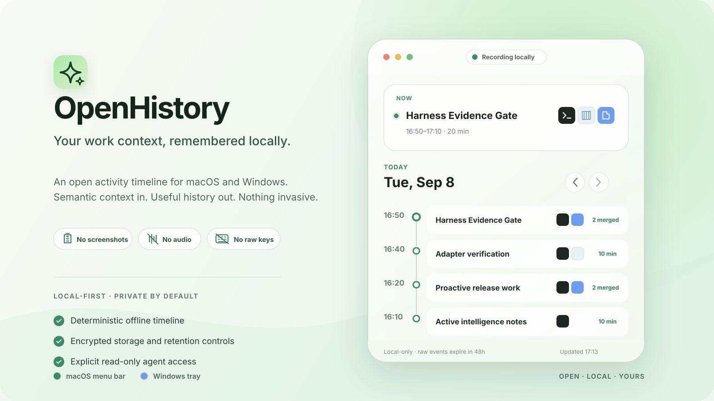

<div align="center">


# OpenHistory

<p>Your work context, remembered locally.</p>

<p>
  <a href="https://github.com/wellorbetter/open-history/actions/workflows/check.yml"></a>
  <a href="https://tauri.app"></a>
  
  <a href="README.zh-CN.md"></a>
</p>

<p><strong>English</strong> · <a href="README.zh-CN.md">简体中文</a></p>
<p><a href="#about">Why</a> · <a href="#privacy-by-design">Privacy</a> · <a href="#development">Development</a></p>

</div>

<p align="center">
  
</p>

OpenHistory is an open, local-only activity timeline for macOS and Windows. It turns consented
semantic accessibility events into deterministic, resumable work context—without screenshots,
audio recording, raw-key logging, accounts, telemetry, or cloud processing.

> **Private alpha:** the fixture UI, domain core, privacy boundary, and unsigned cross-platform
> builds are available. Native collection and production storage are still being completed; do not
> use this build as a daily activity recorder yet.

## About

Computer History can make work resumable, but today that context may be unavailable in your region,
locked inside one product, or exposed without the controls needed for sensitive desktop activity.
OpenHistory is the local-only alternative: capture, storage, search, and summarization stay on your
device, and history becomes available to tools only through separately approved local read-only
access.

| Computer History pain point   | OpenHistory direction                                            |
| :---------------------------- | :--------------------------------------------------------------- |
| Region-gated availability     | Open source and runs directly on your own computer.              |
| History locked to one product | Versioned export, local API, and MCP interoperability.           |
| Unclear capture boundaries    | Semantic events only; no screenshots, audio, or raw keys.        |
| Cloud dependency              | Deterministic capture, segmentation, and summaries work locally. |

## At a glance

| Glance          | Detail                                                                    |
| :-------------- | :------------------------------------------------------------------------ |
| **Compact**     | A menu-bar popover on macOS and notification-area flyout on Windows.      |
| **Useful**      | Current work, daily timeline, search, corrections, summaries, and export. |
| **Local-only**  | Processing stays offline; optional model enrichment runs on device.       |
| **Agent-ready** | Versioned local API and read-only MCP access are explicit opt-ins.        |

## Privacy by design

- Collection stays off until consent and operating-system permission are both present.
- Application, window, website, and private-browser exclusions run before persistence.
- Raw events expire after 48 hours by default; shorter retention and no-raw-history are supported.
- The database uses SQLCipher; its random key belongs in Keychain or Windows Credential Manager.
- Activity data has no cloud processing, synchronization, telemetry, or remote API path.
- Captured text is untrusted data. It never becomes an instruction or executable action.

See the complete [privacy model](docs/privacy.md) and [architecture](docs/architecture.md).

## Development

Prerequisites: Node.js 24, Rust 1.89, and the [Tauri 2 system dependencies](https://tauri.app/start/prerequisites/).

```sh
git clone https://github.com/wellorbetter/open-history.git
cd open-history
npm ci
make check
npm run tauri dev
```

For the browser-only fixture UI, run `npm run dev`, then open `?surface=compact`,
`?surface=history`, or `?surface=setup`.

The implementation is tracked as an [OpenSpec change](openspec/changes/build-open-history-desktop/).
See [local development](docs/development.md) and [contributing](CONTRIBUTING.md) before changing the
capture or privacy boundaries.

## Project status

OpenHistory is under active development. GitHub Actions verifies the frontend and Rust workspace on
macOS and Windows and produces unsigned development binaries. Signed installers and stable releases
will follow only after the complete privacy and end-to-end acceptance suite passes.
