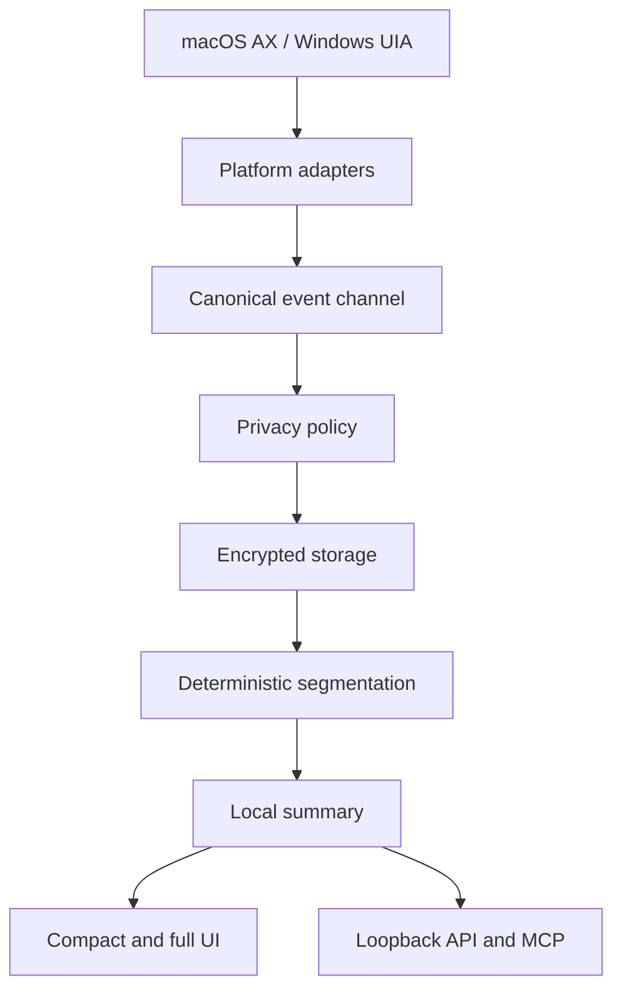

# Architecture

OpenHistory is a single background-capable Tauri 2 desktop process with an on-demand compact
surface and full history window.

The Rust crates are dependency-directed: platform adapters produce `openhistory-domain` events;
privacy runs before storage; segmentation and summaries consume allowed events; API and MCP expose
bounded, read-only derived records. The React UI communicates only through typed Tauri commands.
